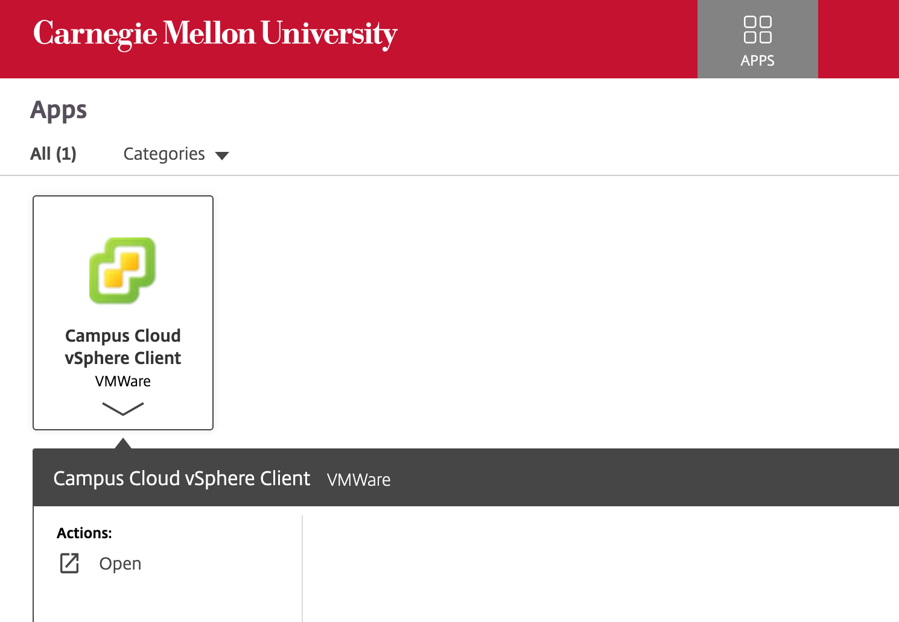
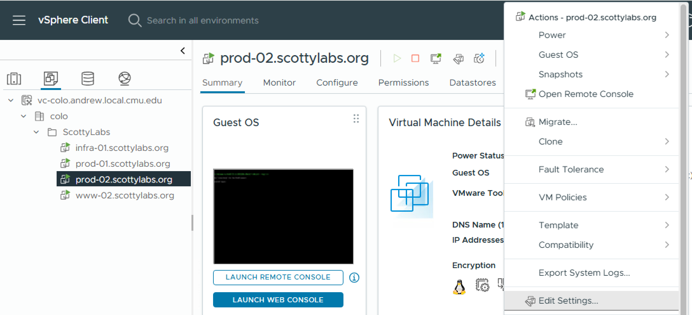
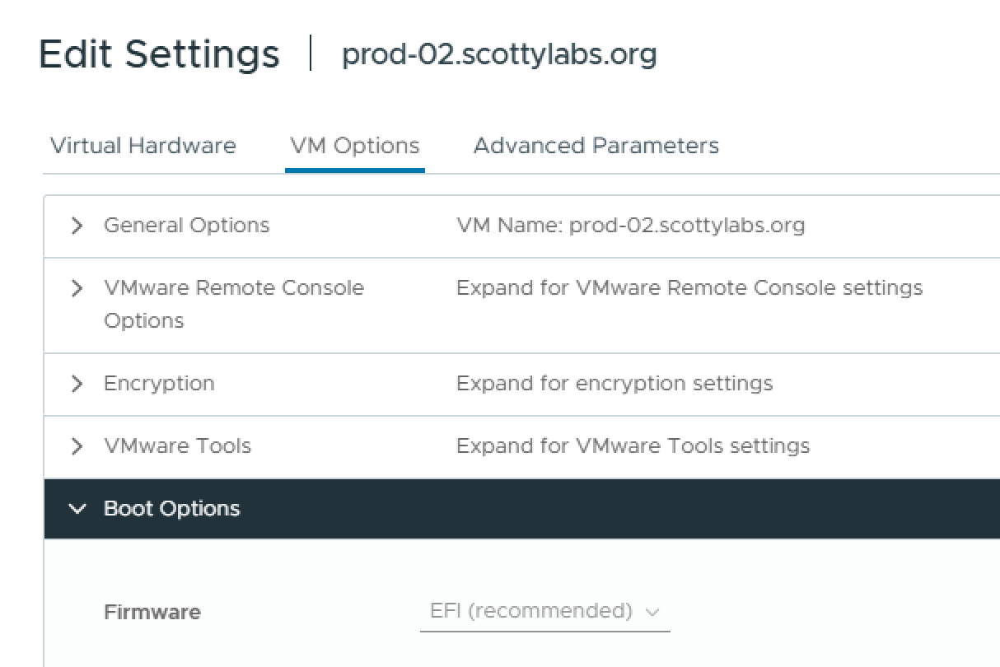

# Preparing for Setup

CampusCloud VMs are managed through vSphere, which is accessed through [Citrix Workspace](https://apps.cmu.edu/). From here, you can select `Campus Cloud vSphere Client`. Install Citrix Viewer when prompted.



This will take you to VMware® vSphere, where you can log in with your CMU credentials. The username is just your Andrew ID (not the email). From here, navigate to the `VM -> Actions -> Edit Settings`:



Here, you can switch the boot mode from the default (Legacy/BIOS) to UEFI via `VM Options -> Boot Options -> Firmware`:



In this repository, add `hostname` to the `hosts` list in [modules/systems.nix](../../modules/systems.nix), and add it to the `hosts` list in the openbao terranix configuration ([modules/hosts/infra-01/openbao.nix](../../modules/hosts/infra-01/openbao.nix)), which provisions its AppRole. If not already present, create a [user entry](../../modules/users.nix) for yourself, following [these instructions](../create-user-entry.md). Then define the host's configuration aspect and its role, following the pattern of the other hosts:

```nix
# host-specific settings go in modules/hosts/hostname/configuration.nix
{
  flake.modules.nixos.hostname-configuration = {
    networking.hostName = "hostname";

    system.stateVersion = "26.11"; # use the version of NixOS you are installing
  };
}
```

```nix
# compose platform, host config, and services in modules/roles/hostname.nix
{ config, ... }:
{
  flake.modules.nixos.hostname.imports = with config.flake.modules.nixos; [
    campus-cloud

    hostname-configuration
  ];
}
```
