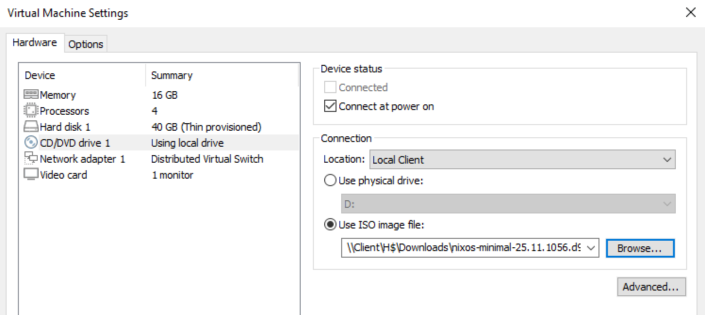

# Installing NixOS

Before continuing, you should first have a local NixOS installation ISO. Download the latest 64-bit Intel/AMD *Minimal ISO* from the [NixOS download page](https://nixos.org/download/#nixos-iso).

Do not power on the VM yet. First, you need to mount the NixOS installation ISO. Press "Launch Remote Console":


Once it opens, navigate to `VMRC -> Manage -> Virtual Machine Settings`:


Then, navigate to `CD/DVD drive 1 -> Connection -> Location`, select `Local Client` and press `Use ISO Image file`. It will open a file dialog. If you are prompted to choose an access level for Citrix, `Read Only` is sufficient.

After navigating to your local ISO file, enable `Connect at power on`, and then power on the VM.



According to Computing Services, "there are usually a couple ways of mounting an ISO on a VM, but we have an extra layer of indirection in getting to Campus Cloud." This means we can’t upload directly to the shared datastore, `shared_vast-01_colomedia`, as trying to do so results in a certificate error. The ISO has to be selected from within VMware Remote Console.

Once the VMWare Remote Console is powered on, you should see the NixOS boot menu. Select the first option, ending in `(Linux LTS)`, to boot into the live environment. It will select itself in a few seconds. First, you need to set the root user password:

```bash
sudo passwd root
```

Create a new entry in Vaultwarden, in the `Tech/Servers` collection, named `hostname.scottylabs.org`. The username should be `root` and the password should be the one you just set. Then, run the install script:

```bash
curl -sSL https://raw.githubusercontent.com/ScottyLabs/infrastructure/main/scripts/provision.sh | NAME=hostname bash
```

When prompted, enter the root user password you set previously. This should complete without errors and automatically reboot into NixOS. It will take a short while, though (mostly due to Neovim).
